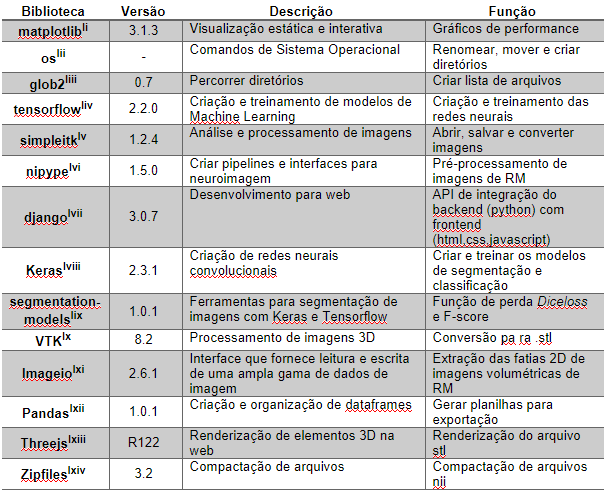

# Trabalho de Conclusão do curso de Engenharia Biomédica da PUC-SP

## Introdução
O TCC consiste em uma plataforma de suporte ao diagnóstico clínico através da segmentação de tumores cerebrais em RM-3D, nódulos pulmonares em TC-3D e classificação de covid 19 em TC-2D.

---
## Metodologia
### Bibliotecas

### Arquitetura
Parâmetros: 19,069,058

### Datasets

---
## Pipeline e Fluxogramas
- **Sistema completo**:

### Pre-processamento
- **BraTS:**

- **LNDB:**

### Frontend e Backend
---
## Resultados

| 3D Overlay |
|:----------:|
||

| Model Performance |
|:----------:|
||

### Modelo XXXXXX
| Histograma Model XXX | Boxplot Model XXX |
|:----------:|:----------:|
||

### Modelo XXXXXX
| Histograma Model XXX | Boxplot Model XXX |
|:----------:|:----------:|
||

### Modelo XXXXXX
| Histograma Model XXX | Boxplot Model XXX |
|:----------:|:----------:|
||

## Referências

