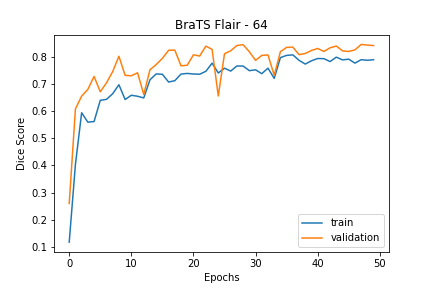
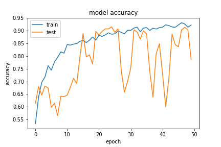

# Trabalho de Conclusão do curso de Engenharia Biomédica da PUC-SP

## INTELIGÊNCIA ARTIFICIAL APLICADA A CLASSIFICAÇÃO E SEGMENTAÇÃO DE IMAGENS MÉDICAS
* ANTONIO CARLOS BATISTA MORENO ac.moreno@icloud.com
* GABRIEL LOUIS PETROFF CORDOVIL bibocord@gmail.com
* IVAN MARREIROS HAZAN ivan.hazan@gmail.com
* PAULO CESAR ESTEVAM FILHO pcesar333@gmail.com

## Introdução
O TCC consiste em uma plataforma de suporte ao diagnóstico clínico através da segmentação de tumores cerebrais em RM-3D, nódulos pulmonares em TC-3D e classificação de covid 19 em TC-2D.

Para utilizar a ferramenta execute e acesse localhost:8000
> python django_tcc/manage.py runserver

---
## Metodologia

Todo o desenvolvimento do projeto e treinamento dos modelos foram realizados em dois computadores: I3-9100F + 1050TI 4GB e I7+1060 6GB
### Bibliotecas

### Bibliotecas e Arquitetura

Parâmetros: 19,069,058

### Datasets

---
## Pipeline e Fluxogramas
- **Sistema completo**:

### Pre-processamento
- **BraTS:**

- **LNDB:**

### Frontend e Backend
---
## Resultados

| 3D Overlay |
|:----------:|
||

| Model Performance |
|:----------:|
||

### BraTS T1ce 64x64x64
Necrose e Enhancing Tumor Segmentation
| Histograma | Boxplot |
|:----------:|:----------:|
||

### BraTS FLAIR 64x64x64
Tumor Core e Edema Segmentation
| Histograma | Boxplot |
|:----------:|:----------:|
||

### BraTS T1-T2-FLAIR 64x64x64
Tumor Core e Edema Segmentation
| Histograma Model XXX | Boxplot Model XXX |
|:----------:|:----------:|
||

### BraTS T1-T2-FLAIR 96x96x96
Tumor Core e Edema Segmentation
| Histograma Model XXX | Boxplot Model XXX |
|:----------:|:----------:|
||

### LNDB TC-3D 64x64x64
Lung Nodule Segmentation
| Histograma Model XXX | Boxplot Model XXX |
|:----------:|:----------:|
||

### COVID-19 TC-2D
COVID Classification

## Referências
1. MICCAI. Multimodal brain tumor segmentation challenge 2020. Disponível em: https://www.med.upenn.edu/cbica/brats2020/. Acesso em: 2 Set. 2020.
2. ICIAR, International Conference on Image Analysis and Recognition. 17th International Conference on Image Analysis and Recognition. Disponível em: https://www.aimiconf.org/iciar20/. Acesso em: 17 jun. 2020.
3. LNDB. Grand challenge on automatic lung cancer patient management. Disponível em: https://lndb.grand-challenge.org/Evaluation/. Acesso em: 17 jun. 2020.
4. WANG, Shuai et al. A deep learning algorithm using CT images to screen for corona virus disease (COVID-19). Disponível em: https://www.medrxiv.org/content/10.1101/2020.02.14.20023028v4.full.pdf+html Acesso em: 10 Abr. 2020
5. SOARES, Eduardo et al. Sars-cov-2 ct-scan dataset: a large dataset of real patients ct scans for sars-cov-2 identification. Disponível em: https://www.medrxiv.org/content/10.1101/2020.04.24.20078584v3 acesso em: 17 jun. 2020.
6. Ronneberger, O., Fischer, P., Brox, T.: U-net: Convolutional networks for biomedical image segmentation. In: MICCAI. LNCS, vol. 9351, pp. 234–241. Springer (2015)
7. ELLIS, David. 3DUnetCNN. Disponível em: https://github.com/ellisdg/3DUnetCNN Acesso em: 20 Jun. 2020.
8. ITK, ITK/File Formats, Disponível em: https://itk.org/Wiki/ITK/File_Formats Acesso em: 7 Set. 2020.
9. DJANGO. Meet Django. Disponível em: https://www.djangoproject.com/ Acesso em 02 Mai. 2020.
10. KAGGLE. Covid-19 diagnosis from images using DenseNet121. Disponível em: https://www.kaggle.com/l12161/covid-19-diagnosis-from-images-using-densenet121. Acesso em: 17 Jun. 2020.

